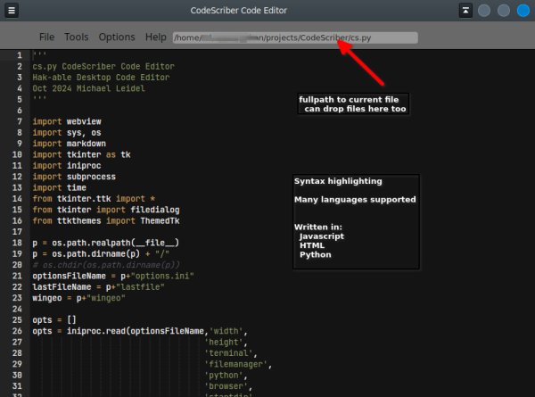
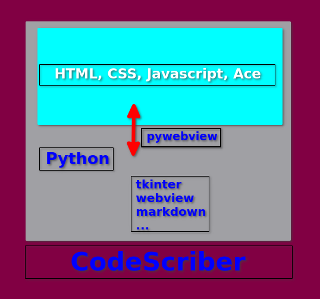

# CodeScriber Documentation

The heart of CodeScriber is the "Ace" Code Editor - a Javascript library.

For the most detailed information about "Ace" visit the 
[Ace website](https://ace.c9.io/ "https://ace.c9.io/")

_CodeScriber_ is written to be a desktop application. All the software resides on the local machine.  
For simplicity, the "Ace" library is loaded from a CDN.

Some features have not been activated because I've chosen features specifically for my own use.

_CodeScriber_ is a code editor written completely in scripting languages: HTML, CSS, Javascript, Python3.  
So theoretically, you could modify it without too much effort, if you want to.

__Additional Hotkeys:__
<table border=1 cellspacing=0>
	<tr>
		<td><b>Ctrl-S</b></td>
		<td>Save</td>
	</tr>
	<tr>
		<td><b>Ctrl-Shft-S</b></td>
		<td>Save-As</td>
	</tr>
	<tr>
		<td><b>Ctrl-Z</b></td>
		<td>Insert Zen Tag</td>
	</tr>
	<tr>
		<td><b>Alt-X</b></td>
		<td>List Zen Tags</td>
	</tr>
	<tr>
		<td><b>Ctrl-Alt-H</b></td>
		<td>Display All Keyboard Shortcuts *</td>
	</tr>
	<tr>
		<td><b>Ctrl-Alt-X</b></td>
		<td>Display enclosure keys</td>
	</tr>
	<tr>
		<td><b>Esc</b></td>
		<td>Quit</td>
	</tr>
	<tr>
		<td><b>Ctrl-Q</b></td>
		<td>Quit</td>
	</tr>
	<tr>
		<td><b>Ctrl-G</b></td>
		<td>Set up a text encloser</td>
	</tr>
	<tr>
		<td><b>Ctrl-0 through 9</b></td>
		<td>Enclose with text</td>
	</tr>
	<tr>
		<td><b>Ctrl -</b></td>
		<td>Run 1</td>
	</tr>
	<tr>
		<td><b>Ctrl =</b></td>
		<td>Run 2</td>
	</tr>
	<tr>
		<td><b>Alt-W</b></td>
		<td>Repeat last text enclosure</td>
	</tr>
	<tr>
		<td><b>Ctrl-R</b></td>
		<td>Recent File List</td>
	</tr>
</table>

---

### Function of Ace Code Editor Library
  _from the Ace "editor" object_ *  

<table style="font-size: 9pt;">
<tr>
<td>
goToNextError - Alt-E 
goToPreviousError - Alt-Shift-E 
selectall - Ctrl-A 
centerselection - null 
gotoline - Ctrl-L 
fold - Alt-L|Ctrl-F1 
unfold - Alt-Shift-L|Ctrl-Shift-F1 
toggleFoldWidget - F2 
toggleParentFoldWidget - Alt-F2 
foldall - null 
foldAllComments - null 
foldOther - Alt-0 
unfoldall - Alt-Shift-0 
findnext - Ctrl-K 
findprevious - Ctrl-Shift-K 
selectOrFindNext - Alt-K 
selectOrFindPrevious - Alt-Shift-K 
find - Ctrl-F 
selecttostart - Ctrl-Shift-Home 
gotostart - Ctrl-Home 
selectup - Shift-Up 
golineup - Up 
selecttoend - Ctrl-Shift-End 
gotoend - Ctrl-End 
selectdown - Shift-Down 
golinedown - Down 
selectwordleft - Ctrl-Shift-Left 
gotowordleft - Ctrl-Left 
selecttolinestart - Alt-Shift-Left 
</td>
<td>
gotolinestart - Alt-Left|Home 
selectleft - Shift-Left 
gotoleft - Left 
selectwordright - Ctrl-Shift-Right 
gotowordright - Ctrl-Right 
selecttolineend - Alt-Shift-Right 
gotolineend - Alt-Right|End 
selectright - Shift-Right 
gotoright - Right 
gotopagedown - PageDown 
scrollup - Ctrl-Up 
scrolldown - Ctrl-Down 
togglerecording - Ctrl-Alt-E 
replaymacro - Ctrl-Shift-E 
jumptomatching - Ctrl-\\|Ctrl-P 
selecttomatching - Ctrl-Shift-\\|Ctrl-Shift-P 
expandToMatching - Ctrl-Shift-M 
removeline - Ctrl-D 
duplicateSelection - Ctrl-Shift-D 
sortlines - Ctrl-Alt-S 
togglecomment - Ctrl-/ 
toggleBlockComment - Ctrl-Shift-/ 
modifyNumberUp - Ctrl-Shift-Up 
modifyNumberDown - Ctrl-Shift-Down 
replace - Ctrl-H 
undo - Ctrl-Z 
redo - Ctrl-Shift-Z|Ctrl-Y 
copylinesup - Alt-Shift-Up 
movelinesup - Alt-Up 
</td>
<td>
copylinesdown - Alt-Shift-Down 
movelinesdown - Alt-Down 
backspace - Shift-Backspace|Backspace 
cut_or_delete - Shift-Delete 
removetolinestart - Alt-Backspace 
removetolineend - Alt-Delete 
removetolinestarthard - Ctrl-Shift-Backspace 
removetolineendhard - Ctrl-Shift-Delete 
removewordleft - Ctrl-Backspace 
removewordright - Ctrl-Delete 
outdent - Shift-Tab 
indent - Tab 
blockoutdent - Ctrl-[ 
blockindent - Ctrl-] 
transposeletters - Alt-Shift-X 
touppercase - Ctrl-U 
tolowercase - Ctrl-Shift-U 
expandtoline - Ctrl-Shift-L 
openCommandPallete - F1 
addCursorAbove - Ctrl-Alt-Up 
addCursorBelow - Ctrl-Alt-Down 
addCursorAboveSkipCurrent - Ctrl-Alt-Shift-Up 
addCursorBelowSkipCurrent - Ctrl-Alt-Shift-Down 
selectMoreBefore - Ctrl-Alt-Left 
selectMoreAfter - Ctrl-Alt-Right 
selectNextBefore - Ctrl-Alt-Shift-Left 
selectNextAfter - Ctrl-Alt-Shift-Right 
toggleSplitSelectionIntoLines - Ctrl-Alt-L 
alignCursors - Ctrl-Alt-A 
findAll - Ctrl-Alt-K 
</td>
</tr></table>

---

## *Zen* Tags

The file `tags.js` holds some tags for use with the Zen tag insert feature Alt-Z.

To use: type in the "command" word and hit Alt-Z. The word is replaced by "output".

Use the Options menu 'Zen Tags" to view the `tags.js` file and modify it to your own needs.

<code>
  const atags = { 
  	"command": "output", 
  	"command": "output", 
  	"command": "output", 
  }; 
</code>

Example:  
<code>
`"input": "<input type='' id='' value='' />",`
</code> 
In the editor, type _input_ and press Alt-Z  
'input' is replaced by `<input type='' id='' value='' />`

---

## Enclosing text with markup hotkeys

There is an array to hold up to 10 (0-9) surrounding markup texts.  
Defaults are set in the `stag.js` file.  

        var stag = ["<strong>,</strong>",
                    "
,
",
                    "<em>,</em>",
                    "<code>,</code>",
                    "<dt>,</dt>",
                    "<dd>,</dd>",
                    "
,
",
                    "",
                    "_,_",
                    "**,**"];

Apply these to selected text using Ctrl-0,1,2,...9  
Change any of them for current session using Ctrl-G.  
Edit the defaults in the **Options** menu "Enclosures".

---

**When working with Markdown, HTML is _generated on every save_.**  
Use the Tools menu "**Markdown**" to open the HTML in a browser for review.  
This Markdown follows rules from the 
[Markdown 3.7](https://pypi.org/project/Markdown/ "markdown module") python3 module.

---

## options.ini

**CodeScriber options**
    
    future1
    future2
    terminal=gnome-terminal --working-directory=
    filemanager=thunar
    previous=yes
    browser=firefox
    scope=/home/UsEr
    run1=/blah/blahh/CodeSnips/csnips.py
    run2=gnome_terminal -e htop

The Windows options.ini could look more like this:

    future1
    future2
    terminal=wt -d
    filemanager=explorer.exe
    previous=yes
    browser="C:\Program Files\BraveSoftware\Brave-Browser\Application\brave.exe"
    scope=C:\
    run1="C:\Program Files\BraveSoftware\Brave-Browser\Application\brave.exe" https://www.w3schools.com/
    run2=cmd
    
The geometry of the CodeScriber's window dimensions are remembered.

**terminal**
>Enter your terminal preference and the option to  
start at a specific working directory.

**filemanager**
>The name of your systems file manager executable file.

**previous**
>yes|no Open last file at start-up.

**browser**
>The executable of the browser you wish to use.
Default if you want to use your system default browser.

**scope**
>Set the "root" in your file system that CodeScriber should use.

**run1 and run2**
>External programs you might want to execute.
_Ctrl -_ and _Ctrl =_ respectively.

---

## Run CodeScriber

CodeScriber is run like any other python script.

Example:

<code>
$>python3 cs.py  
$>python3 cs.py fileToOpen.js  
</code>

or with a Bash file:  
<code>
\# cs  
cd /home/user/ ... /CodeScriber  
python3 cs.py $1 &
</code>

><code>
>$>cs  
>$>cs fileToOpen.js
></code>

---

## Menus

### Tools menu

_The context menu is a repeat of the tools menu and some File menu items._

- **Terminal**  
  Open a terminal as designated in the _options.ini_

- **File Mgr**  
  Open your file manager as designated in the _options.ini_ 

- **Browser**  
  Open current file with the browser specified in _options.ini_

- **Markdown**  
  Open your markdown document's compiled HTML in your browser.  
  Each save of a markdown document generates it's HTML file.

- **Run1 & Run2**   
  Executes a process as designated in _options.ini_

- **Find File**  
  Find (and open) a file anywhere on the system

### Options menu

- **File Modes**  
  Opens the `filemodes.js` file for editing languages and themes

- **Zen Tags**  
  Open the `tags.js` file for editing the json array of tags and code

- **Enclosures ** 
  Open the `stag.js` file for editing the 7 enclosure markups

- **Options**  
  Open the `options.ini` file for editing

## Note for Windows Users

If you uninstall Microsoft Edge or any of its components, CodeScriber will not work.  
This is because pywebview uses Edge components for rendering.

---

