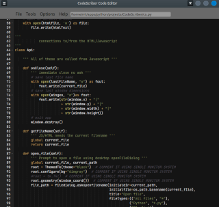
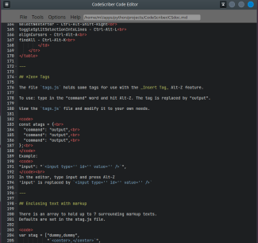

# CodeScriber

## A Desktop Code Editor for Linux and Windows

__Uses "web app" technology via Python, pywebview, Ace Code Editor API__

>

_See_ <a href='https://ace.c9.io/'>https://ace.c9.io</a> _for information on the Ace Code Editor._

### Features:

- Syntax highlighting
- Auto indentation and outdent
- An optional command line
- Work with large documents (handles hundreds of thousands of lines without issue)
- Fully customizable key bindings including vi and Emacs modes
- Themes and many language models
- Search and replace with regular expressions
- Highlight matching parentheses
- Toggle between soft tabs and real tabs
- Displays hidden characters
- Highlight selected word
- Multiple cursor selection
- Column select and edit mode
- Customizable Keyword code snipits
- Drag & Drop to open file
- Find File
- Recent Files
- Context Menu

[Documentation](CSdoc.html "title")

### CodeScriber combines the following technologies:
> - python (pywebview, markdown, tkinter.ttk)  
> - javascript  
> - API (ace.js)  
> - css  
> - html  

### Initial language models:
> _python, c, html, css, markdown, javascript, bash, sql, golang, json_  
Modify this list in `filemodes.js` - see **File Modes** under Options menu.

   

[Documentation](CSdoc.md "title")

---

